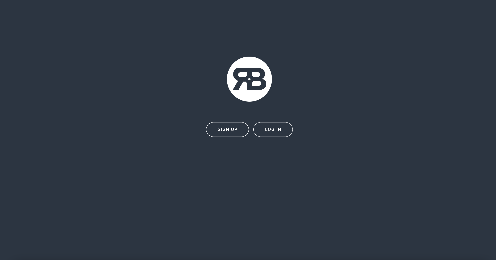
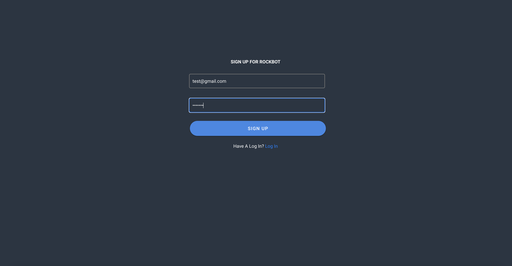
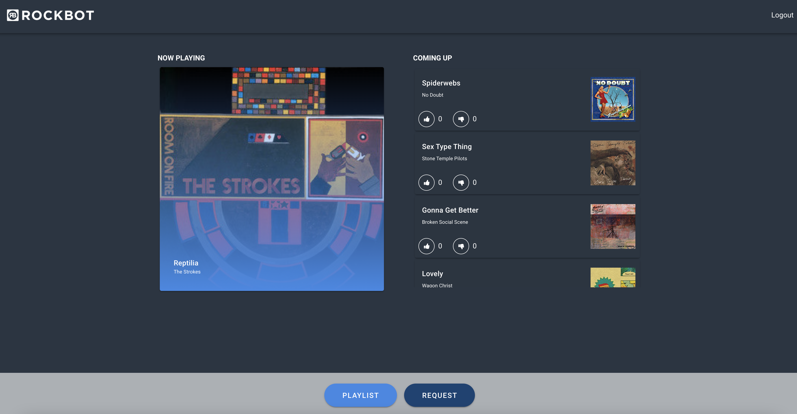
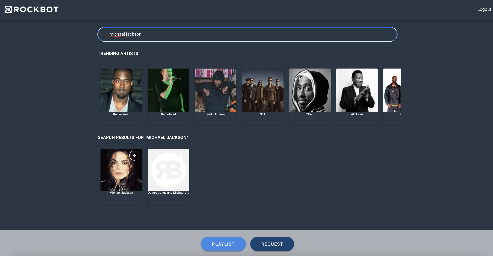

# Mini Rockbot 

## Description 
This is an application build in Vue for Rockbot that uses REST API to allow users to see what's playing, vote, trending artists, and request music. This application uses Vuetify as the framework for components, Axios for API requests, Firebase for user authentication, and Vue Router. Users will be required to signup/login to access the application. Once logged in, a user will be able to like and dislike songs which will either move them up or down in the queue and can look for artists to add to the playlist queue. 

## Table of Contents
* [Installation](#installation)
* [Usage](#usage)
* [Questions](#questions)

## Installation 
This application uses Vue CLI and Vue router which will need to be installed. After cloning the repo run `npm install` which will run all dependencies. This application also requires your own API key. The API key should be stored in a `.env.local` file with the variable `VUE_APP_API_KEY = YOUR KEY`. Then to run application server in the browser run `npm run serve`. To deploy, this application requires a build. To run the build, run `npm run build`. 
 
A user login is required to access the application. Either sign up using by clicking on the sign up page or login with the test login `email: test@gmail.com password: test123`. 

## Usage 
This application will allow users to view the current song in the playlist and the next songs in the queue. Users will also be able to view top artists and search through artists. 

## Questions
If you have any questions about this projects, please contact me directly at nicole.elisaw@gmail.com. You can view more of my projects at https://github.com/nicolewallace09.